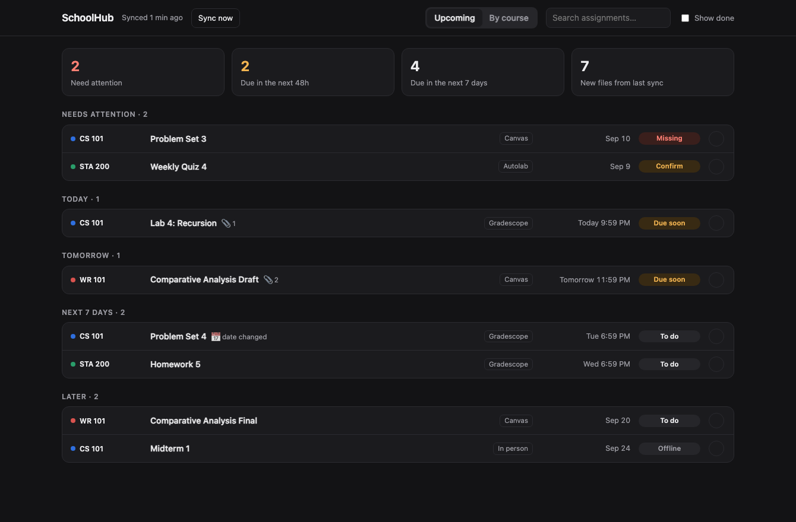

# SchoolHub

One local dashboard for every assignment across Canvas, Gradescope and plain course websites —
with all the files downloaded into your own class folders.

No AI, no cloud, no account: a Python script talks to your school's APIs, saves files where you'd
put them yourself, and writes a static page you open in your browser. Everything stays on your Mac.



## What it does

- **Collects assignments** from Canvas (API), Gradescope (unofficial API) and course websites that
  have their own parser (15-122 at CMU ships as an example), and merges duplicates: a homework that
  exists on both Canvas and Gradescope is one row, with whichever source knows the most.
- **Downloads files** into your existing class folders: assignment attachments, the files you
  submitted, Canvas module files, a course's whole Files page where permitted, and public handouts
  from course sites. Never deletes; never overwrites a file you've edited (it saves
  `name (updated 2026-09-12).ext` alongside instead).
- **Tracks status** per assignment: To do, Due soon, Submitted, Graded, Missing, Offline.
- **Mark as done** with ✓ for work the APIs can't see (paper hand-ins, Autolab). The next sync
  double-checks each mark against Canvas/Gradescope and flags any it can't confirm.
- **Add your own tasks** with the **+** button (or press **N**): a name, a course or "Personal", an
  optional due date and time, and notes. They get ✓, Undo, overdue warnings and due-soon alerts like
  everything else, and they show up on the phone view.
- **Tells you what changed**: due dates that moved, newly posted assignments, work due within 36
  hours that isn't done, and anything newly missing.
- **Fails loudly**: if a course website changes shape, the parser refuses to guess — it reports the
  problem and keeps showing the last good copy.

## Install

```bash
git clone https://github.com/ArnavBali36/schoolhub.git
cd schoolhub
python3 -m venv .venv
.venv/bin/pip install truststore gradescopeapi   # gradescopeapi only if you use Gradescope
cp config.example.json config.json
chmod 600 config.json          # it will hold your token and password
```

Then edit `config.json`:

- `canvas_base_url`: e.g. `https://canvas.instructure.com`, no trailing slash.
- `canvas_token`: Canvas → Account → Settings → **+ New Access Token**. Treat it like a password;
  it can do anything your account can.
- `school_root`: the folder holding your class folders.
- `canvas_courses`: map each Canvas course id → the folder name to use, plus a short label.
  Get the ids by running the sync once; unmapped courses land in `Other/<course name>`.
  Add `"skip": true` to hide a course.
- `gradescope`: your Gradescope email and password (optional). If your school uses single sign-on,
  set a Gradescope password first via "Forgot password".
- `web_courses`: course sites with a parser in this repo.

Run it:

```bash
.venv/bin/python sync.py        # ~1 minute
open dashboard.html
```

## The local server (optional but recommended)

`server.py` serves the dashboard on <http://localhost:8722>, which adds:

- the ✓ **mark as done** buttons (saved to `state/marks.json`, checked by the next sync)
- the **+** button for your own tasks (saved to `state/tasks.json`)
- **Sync now** in the header
- files opening in their real apps, and folders in Finder
- a **catch-up sync** if the data is more than 20 hours old

It binds to `127.0.0.1` only, refuses cross-site requests (custom-header + Host checks), and never
serves its own folder, so your token stays out of the browser.

```bash
.venv/bin/python server.py
```

To run it at login on macOS, copy `examples/com.schoolhub.server.plist` to
`~/Library/LaunchAgents/`, fix the paths inside, and
`launchctl bootstrap gui/$(id -u) ~/Library/LaunchAgents/com.schoolhub.server.plist`.

## Nightly sync

`sync.py` prints nothing unless something needs your attention, which makes it a good cron job:

```
0 5 * * *  /path/to/schoolhub/.venv/bin/python /path/to/schoolhub/sync.py
```

It stops itself after 15 minutes (`SCHOOLHUB_TIMEOUT` seconds) rather than hanging, keeps the last
good copy of anything it couldn't reach, and reports the timeout.

## Phone view (optional)

`publish.py` builds a read-only copy of the dashboard into `schoolhub-site/` and can deploy it to
Vercel, so you can check your assignments from your phone:

```bash
.venv/bin/python publish.py            # build only
npx vercel login                       # once
.venv/bin/python publish.py --deploy   # build + deploy, prints your URL
```

There's no login screen. Instead the page is published under one unguessable path segment
(generated into `config.json` as `site.secret`), with `robots.txt` and `X-Robots-Tag: noindex` so it
stays out of search engines. **Anyone with the link can read your assignments and grades, so treat
the link like a password.** Prefer a real login? Put the site behind your host's password protection
and drop the secret path.

The hosted copy has no file links (files live on your Mac), and it's read-only unless you connect
the free database below.
Set `site.auto_deploy` to `true` in `config.json` and every sync republishes it, so the phone view
keeps up with the nightly run.

New Vercel projects enable "Vercel Authentication" (Settings → Deployment Protection), which puts a
Vercel login in front of the site. Turn it off if you want the link to just work.

## Edit from your phone (optional, free)

Connect a free Upstash Redis database to the Vercel project and the phone view can save ✓ marks and
tasks too. Your Mac and phone then share one copy of both; grades and files stay where they are.

1. Vercel dashboard → your project → **Storage** → **Create Database** → **Upstash for Redis** →
   Free plan → connect it to the project.
2. Give the site's API its key, and pull the database credentials to your Mac:
   ```bash
   cd schoolhub-site
   printf '%s' "<site.secret from config.json>" | npx vercel env add SCHOOLHUB_SECRET production
   npx vercel env pull ../state/cloud.env --environment=production
   ```
3. Restart `server.py` (on first start it copies your existing marks and tasks up), then run
   `publish.py --deploy`.

`vercel/api/state.js` only answers requests that carry the site's secret path segment. The database
token stays on Vercel and in `state/cloud.env` (gitignored) and never reaches the browser.

## Where files land

```
<school_root>/<course folder>/
├── Assignments/<assignment>/      attachments, Instructions.html, Submitted/
├── Materials/<module>/            Canvas module files, course-site handouts
└── Files/<folder>/                mirror of the Canvas Files page (when permitted)
```

`state/manifest.json` records what was downloaded (by file id and version), so re-runs only fetch
what's new or changed.

## Adding your own course website

Course sites vary, so each gets a small parser. Copy `cs15122_source.py`, keep the same
`sync(wcfg, root, store, now)` signature, return a course dict with `assignments` and `materials`,
and raise an exception if the page stops matching what you expect — the sync will show the last good
copy instead of silently losing the course. Then add an entry to `web_courses` in your config.

## Notes and limits

- **Gradescope has no official API.** `gradescopeapi` logs in as you by scraping, so it can break
  when Gradescope changes. Failures are reported, never silent.
- **Autolab isn't supported**, so those submissions can't be verified; mark them done yourself.
- **Canvas access is read-only here.** Nothing in this repo submits, posts or deletes.
- Your token and password live only in `config.json` (gitignored), and your school data only in
  `data.js` and `state/` (also gitignored).

## License

MIT
