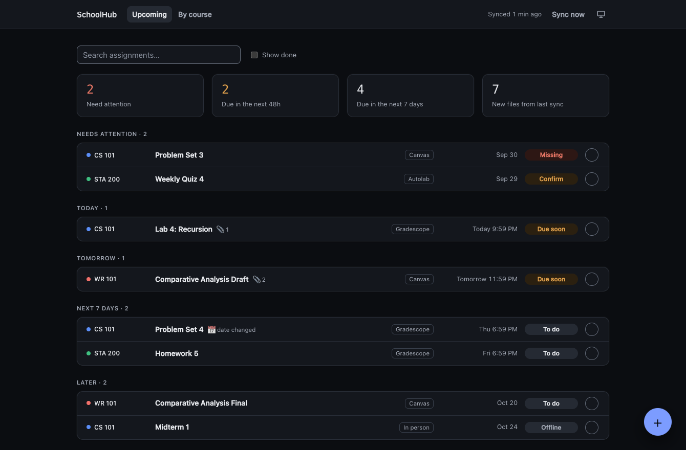

# SchoolHub

One local dashboard for every assignment across Canvas, Gradescope and plain course websites —
with all the files downloaded into your own class folders.

No AI, no cloud, no account: a Python script talks to your school's APIs, saves files where you'd
put them yourself, and writes a static page you open in your browser. Everything stays on your Mac.



## What it does

- **Collects assignments** from Canvas (API), Gradescope (unofficial API) and course websites that
  have their own parser (15-122 at CMU ships as an example), and merges duplicates: a homework that
  exists on both Canvas and Gradescope is one row, with whichever source knows the most.
- **Downloads files** into your existing class folders: assignment attachments, the files you
  submitted, Canvas module files, a course's whole Files page where permitted, and public handouts
  from course sites. Never deletes; never overwrites a file you've edited (it saves
  `name (updated 2026-09-12).ext` alongside instead).
- **Tracks status** per assignment: To do, Due soon, Submitted, Graded, Missing, Offline.
- **Mark as done** with ✓ for work the APIs can't see (paper hand-ins, Autolab). The next sync
  double-checks each mark against Canvas/Gradescope and flags any it can't confirm.
- **Add your own tasks** with the **+** button (or press **N**): a name, a course or "Personal", an
  optional due date and time, and notes. They get ✓, Undo, overdue warnings and due-soon alerts like
  everything else, and they show up on the phone view.
- **Tells you what changed**: due dates that moved, newly posted assignments, work due within 36
  hours that isn't done, and anything newly missing.
- **Fails loudly**: if a course website changes shape, the parser refuses to guess — it reports the
  problem and keeps showing the last good copy.

## Install

```bash
git clone https://github.com/ArnavBali36/schoolhub.git
cd schoolhub
python3 -m venv .venv
.venv/bin/pip install truststore gradescopeapi   # gradescopeapi only if you use Gradescope
cp config.example.json config.json
chmod 600 config.json          # it will hold your token and password
```

Then edit `config.json`:

- `canvas_base_url`: e.g. `https://canvas.instructure.com`, no trailing slash.
- `canvas_token`: Canvas → Account → Settings → **+ New Access Token**. Treat it like a password;
  it can do anything your account can.
- `school_root`: the folder holding your class folders.
- `canvas_courses`: map each Canvas course id → the folder name to use, plus a short label.
  Get the ids by running the sync once; unmapped courses land in `Other/<course name>`.
  Add `"skip": true` to hide a course.
- `gradescope`: your Gradescope email and password (optional). If your school uses single sign-on,
  set a Gradescope password first via "Forgot password".
- `web_courses`: course sites with a parser in this repo.

Run it:

```bash
.venv/bin/python sync.py        # ~1 minute
open dashboard.html
```

## The local server (optional but recommended)

`server.py` serves the dashboard on <http://localhost:8722>, which adds:

- the ✓ **mark as done** buttons (saved to `state/marks.json`, checked by the next sync)
- the **+** button for your own tasks (saved to `state/tasks.json`)
- **Sync now**, next to the time of the last sync (in the header, or above the lists on a phone)
- files opening in their real apps, and folders in Finder
- a **catch-up sync** if the data is more than 20 hours old

It binds to `127.0.0.1` only, refuses cross-site requests (custom-header + Host checks), and never
serves its own folder (however its name is spelled: macOS ignores case) or any hidden file or folder,
so your token stays out of the browser. Class files are shown, never run: an SVG or HTML file opens
in a sandbox with no script, and a `.js` file comes as plain text. The page itself runs only its own
scripts (a Content-Security-Policy of `script-src 'self'`).

```bash
.venv/bin/python server.py
```

To run it at login on macOS, copy `examples/com.schoolhub.server.plist` to
`~/Library/LaunchAgents/`, fix the paths inside, and
`launchctl bootstrap gui/$(id -u) ~/Library/LaunchAgents/com.schoolhub.server.plist`.

To run a second copy beside it (say, a test folder), give it another port:
`SCHOOLHUB_PORT=8733 .venv/bin/python server.py`.

**After updating SchoolHub** (`git pull`), restart the server: it reads its list of page files when
it starts, so an old one serves the new page without its scripts and the dashboard stays blank. If
it runs at login: `launchctl kickstart -k gui/$(id -u)/com.schoolhub.server`.

## Light and dark

The button at the right of the header steps through **System**, **Light** and **Dark**. System
follows your Mac's appearance, and changes with it while the page is open. The choice is saved in
the browser (localStorage `qp.theme`), and a change in one tab applies to every other open tab of
the same address. `theme-init.js` sets the theme before the page first paints, so it never flashes
the other one, and `bar.js` fills in the header (the theme button, the view you were on) before it
is first drawn.

## Running under a path prefix

The dashboard asks its own server for everything with relative URLs (`api/marks`, `data.js`,
`file/<name>?p=…`), so another server can put it under a path such as `/school/` by forwarding
`/school/<rest>` to `http://127.0.0.1:8722/<rest>` (with `Host` set to `127.0.0.1:8722`, and the
`X-SchoolHub` header passed through on POSTs). The page's scripts are files of their own, so it
also runs under a Content-Security-Policy of `script-src 'self'`. In a class file's link the name
is only there so the browser's tab shows it; the server serves the file that `p` names.

If that server also answers `platform.json` next to the page, the dashboard joins it as one
platform: the plain title becomes a switch between the apps, and **O** opens the other one.

```json
{"apps": [{"id": "quant", "name": "QuantPrep", "href": "/"},
          {"id": "school", "name": "School", "href": "/school/"}]}
```

`id` `school` is SchoolHub itself; every `href` must be a path on the same address. Opened on
its own port (where `platform.json` answers 204 No Content), from disk or as the phone view there
is no platform, and nothing changes. The last answer is kept in the browser (localStorage
`qp.platform`), so the switch is drawn from the first paint on the next visit.

A platform that also serves your other devices (say, your phone over a private network to the Mac)
adds `"remote": true` to `platform.json` for their requests. The dashboard then offers nothing that
would act on the Mac's own screen: files the browser can show (PDFs, pictures, text) open in a tab
as usual, every other file downloads (its link carries a small ↓ and the tooltip "Downloads to this
device"), and a folder is shown as text ("On your Mac: ~/…") instead of Open folder. Marks, tasks
and Sync now work as on the Mac. If `platform.json` gives any other answer than 200 or 204 (or
404), the page plays safe and behaves as remote. The forwarding server must also refuse `api/open`
and `api/reveal` itself for those requests: the page leaving them out is a convenience, not the
protection.

A platform that puts a public copy of the dashboard on the internet (saving marks and tasks to a
shared database, such as Turso below) adds `"public": true`. The page then behaves as from another
device, except that files are listed by name only, as on the phone view, and there is no Sync now:
syncs run on your Mac. That server answers `data.js` and the `api/` routes for marks and tasks
itself, and serves no files.

## Tests

```bash
.venv/bin/python -m unittest discover tests
```

They use a throwaway folder with made-up data, never your `config.json`, `state/` or `data.js`.
The checks of the dashboard's file and folder links run its own code under Node when `node` is
installed, and are skipped otherwise. The Turso checks run against a stand-in for its HTTP API
(`tests/fake_turso.py`) over a throwaway SQLite file, never a real database.

## Nightly sync

`sync.py` prints nothing unless something needs your attention, which makes it a good cron job:

```
0 5 * * *  /path/to/schoolhub/.venv/bin/python /path/to/schoolhub/sync.py
```

It stops itself after 15 minutes (`SCHOOLHUB_TIMEOUT` seconds) rather than hanging, keeps the last
good copy of anything it couldn't reach, and reports the timeout.

## Phone view (optional)

`publish.py` builds a read-only copy of the dashboard into `schoolhub-site/` and can deploy it to
Vercel, so you can check your assignments from your phone:

```bash
.venv/bin/python publish.py            # build only
npx vercel login                       # once
.venv/bin/python publish.py --deploy   # build + deploy, prints your URL
```

There's no login screen. Instead the page is published under one unguessable path segment
(generated into `config.json` as `site.secret`), with `robots.txt` and `X-Robots-Tag: noindex` so it
stays out of search engines. **Anyone with the link can read your assignments and grades, so treat
the link like a password.** Prefer a real login? Put the site behind your host's password protection
and drop the secret path.

The hosted copy has no file links (files live on your Mac), and it's read-only unless you connect
the free database below.
Set `site.auto_deploy` to `true` in `config.json` and every sync republishes it, so the phone view
keeps up with the nightly run.

New Vercel projects enable "Vercel Authentication" (Settings → Deployment Protection), which puts a
Vercel login in front of the site. Turn it off if you want the link to just work.

## Edit from your phone (optional, free)

Connect a free Upstash Redis database to the Vercel project and the phone view can save ✓ marks and
tasks too. Your Mac and phone then share one copy of both; grades and files stay where they are.

1. Vercel dashboard → your project → **Storage** → **Create Database** → **Upstash for Redis** →
   Free plan → connect it to the project.
2. Give the site's API its key, and pull the database credentials to your Mac:
   ```bash
   cd schoolhub-site
   printf '%s' "<site.secret from config.json>" | npx vercel env add SCHOOLHUB_SECRET production
   npx vercel env pull ../state/cloud.env --environment=production
   ```
3. Restart `server.py` (on first start it copies your existing marks and tasks up), then run
   `publish.py --deploy`.

`vercel/api/state.js` only answers requests that carry the site's secret path segment. The database
token stays on Vercel and in `state/cloud.env` (gitignored) and never reaches the browser.

## Marks, tasks and data.js in Turso (optional)

Instead of Upstash, SchoolHub can keep ✓ marks and your own tasks in a [Turso](https://turso.tech)
database (hosted libSQL, free tier) that other apps share: say, a hosted copy of the dashboard that
saves marks to the same place. Put its URL and a token in `state/cloud.env`, by hand or with
`npx vercel env pull` from a Vercel project the database is connected to:

```
TURSO_DATABASE_URL="libsql://<database>-<org>.turso.io"
TURSO_AUTH_TOKEN="<token>"
```

With both set, SchoolHub uses Turso (even if Upstash's variables are there too). Then:

1. Restart `server.py`, which reads `state/cloud.env` only when it starts (with the launchd service:
   `launchctl kickstart -k gui/$(id -u)/com.schoolhub.server`).
2. Run `python3 cloud.py`. It says which database `state/cloud.env` names and counts the marks and
   tasks in it, reading only. `server.py` quietly falls back to the local files whenever the
   database does not answer, so this is how you see that the database is reachable. It reads the
   file afresh, so it checks what the next start of `server.py` will use, not the one already
   running: restart first.
3. Run Sync now (or `python3 sync.py`) once, so the hosted copy has your assignments.

- Marks and tasks are rows of `school_kv` (`name` is `marks` or `tasks`, `key` the assignment or task
  id, `value_json` the object, `updated_at` in milliseconds). On first start `server.py` copies the
  ones you already have into an empty table.
- After every sync, a copy of the new `data.js` is saved as the one row of `school_data`, so the
  hosted copy shows the same assignments. If that fails, the sync still finishes and lists it with
  its other issues. The hosted copy shows no assignments until the first sync after you add these
  lines (step 3).
- The phone view above keeps saving to Upstash, which your Mac no longer reads: ✓ marks and tasks
  made there stay there. Use the hosted copy that reads Turso instead, and set `site.auto_deploy`
  to `false` if you no longer want the phone view republished after each sync.

It talks to Turso's HTTP API (`/v2/pipeline`) with the standard library; the token stays in
`state/cloud.env`. SchoolHub never creates or changes tables: on a database of your own, make them
once with `turso db shell <database> < turso-schema.sql`; if another app owns the database and makes
them with its own migrations, leave it to that app.

What goes to `school_data` is made to be shown without a login (`public_copy` in `sync.py`): your
assignments, grades, feedback and Canvas instructions as they are, but paths on your Mac written from
`~` (no user name) and links without the parameters that open a file without signing in (Canvas's
`verifier=`, a storage link's signature). Never the files themselves. Your own `data.js` keeps
everything. Anyone who can read the database, or open a hosted copy without a login, can read what
it holds.

## Where files land

```
<school_root>/<course folder>/
├── Assignments/<assignment>/      attachments, Instructions.html, Submitted/
├── Materials/<module>/            Canvas module files, course-site handouts
└── Files/<folder>/                mirror of the Canvas Files page (when permitted)
```

`state/manifest.json` records what was downloaded (by file id and version), so re-runs only fetch
what's new or changed.

## Adding your own course website

Course sites vary, so each gets a small parser. Copy `cs15122_source.py`, keep the same
`sync(wcfg, root, store, now)` signature, return a course dict with `assignments` and `materials`,
and raise an exception if the page stops matching what you expect — the sync will show the last good
copy instead of silently losing the course. Then add an entry to `web_courses` in your config.

## Notes and limits

- **Gradescope has no official API.** `gradescopeapi` logs in as you by scraping, so it can break
  when Gradescope changes. Failures are reported, never silent.
- **Autolab isn't supported**, so those submissions can't be verified; mark them done yourself.
- **Canvas access is read-only here.** Nothing in this repo submits, posts or deletes.
- Your token and password live only in `config.json` (gitignored), and your school data only in
  `data.js` and `state/` (also gitignored).

## License

MIT
